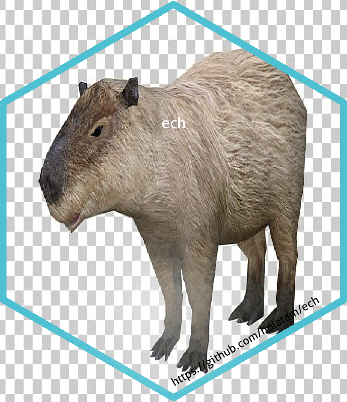
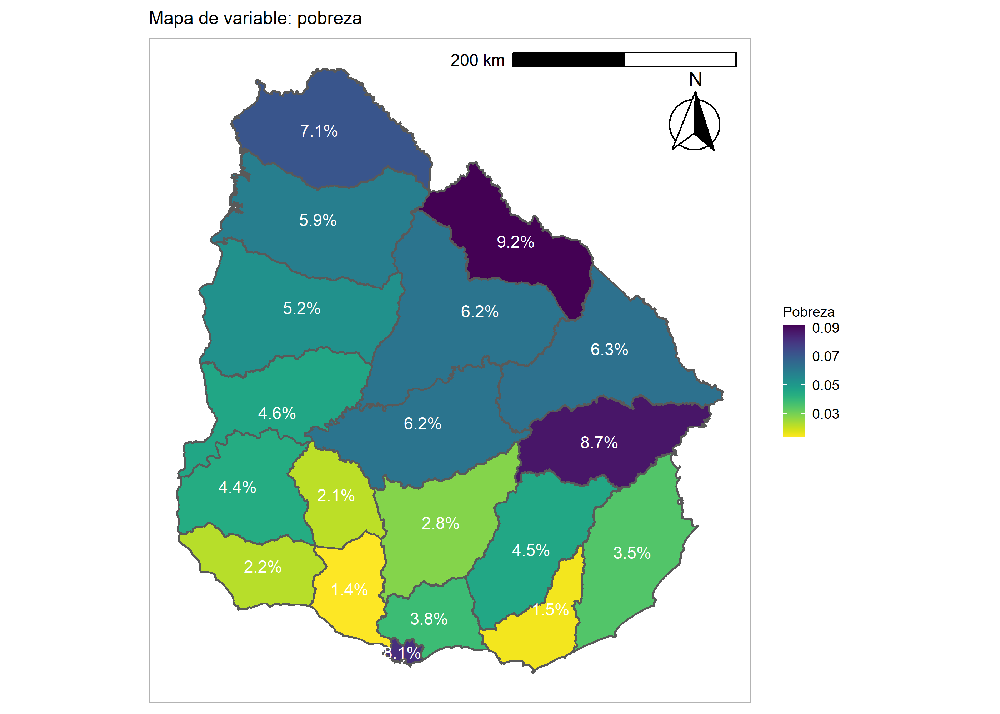

<!-- README.md is generated from README.Rmd. Please edit that file -->

# ech 

<!-- badges: start -->

[](https://CRAN.R-project.org/package=ech)
[](https://CRAN.R-project.org/package=ech)
[](https://CRAN.R-project.org/package=ech)
[](https://github.com/calcita/ech//actions)
[](https://ci.appveyor.com/project/calcita/ech)
[](https://app.codecov.io/gh/calcita/ech?branch=master)
[](https://zenodo.org/badge/latestdoi/224897952)
<!-- badges: end -->

Caja de herramientas para el procesamiento de la [Encuesta Continua de
Hogares de Uruguay](https://www.gub.uy/instituto-nacional-estadistica/datos-y-estadisticas/encuestas/encuesta-continua-hogares)
del Instituto Nacional de Estadística (INE). Pretendemos contribuir a la
comunidad de usuaries de R en Uruguay, facilitando el uso de una de las
encuestas socioeconómicas más importantes del país. En este sentido, el
paquete implementa una serie de funciones que permiten el cálculo de los
principales indicadores socioeconómicos que permite la encuesta.

# Instalación

Para la versión estable

``` r
install.packages('ech') 

library(ech)
```

Para la versión en desarrollo

``` r

# install.packages('devtools') 
# si no tiene instalado devtools

devtools::install_github("calcita/ech")
library(ech)
```

# Funciones para leer datos

Una serie de funciones del paquete que se usan internamente permiten
descargar de la página del INE y convertir a un formato tidy los datos
de: Índice de Precios al Consumo (IPC con base 2010), el Índice de
Precios de Alimentos y Bebidas (IPAB con base 2010), Canasta Básica
Alimentaria y No Alimentaria (CBA y CBNA), la codigue de CIIU4, los
microdatos de cada ECH y sus respectivos diccionarios para los años 2011
a 2019.

# Funciones para crear variables

Las funciones para crear variables se organizan según la dimensión a la
cual corresponden, así tenemos:

  - Vivienda (Dwelling): permite calcular la situación estructural y
    coyuntural de la vivienda, las privaciones de la vivienda,
    hacinamiento y la tenencia de la vivienda.

  - Educación (Education): permite calcular el máximo nivel alcanzado,
    los años de estudio, la completitud según niveles, la asistencia a
    un centro educativo.

  - Mercado de trabajo (Employment): permite calcular la condición de
    actividad, la PEA (población económicamente activa), PET (población
    en edad de trabajar), PO (población ocupada) y PD (población
    desocupada), las restricciones al empleo, subempleo y las ramas de
    actividad según CIIU4.

  - Tipo de hogar (Household type): permite construir una tipología de
    hogar.

  - Ingresos y desigualdad (Income): permite calcular el ingreso
    deflactado (por el índice y año base elegido), quintiles y deciles
    de ingreso, el ingreso laboral per cápita y por hora.

  - Pobreza (Poverty): permite calcular pobreza e indigencia y las NBI
    (Necesidad Básicas Insatisfechas).

# Funciones para estimar indicadores

Se pueden estimar medias, medianas y proporciones, totales y ratios, el
Índice de Gini, el Brecha salarial de género (GPG, por sus siglas en
inglés Gender Pay Gap) y la relación quintil5/quintil1 (QSR, Quintil
Share Ratio). Para los años 2018 y 2019 se cuenta con la información de
las UPM (Unidades Primarias de Muestreo) y estratos por lo cual es
posible definir correctamente el diseño de muestra y obtener intervalos
de confianza correctos.

# Modo de uso

El paquete ech permite descargar los microdatos oficiales desde la web
del INE o bien utilizar microdatos ya procesados. En el primer caso los
datos se obtiene a través de la función `get_microdata()`. En el segundo
caso, puede usar la función `read_microdata()` para leerlos. El paquete
tiene tres grandes conjuntos de funciones: - las que leen datos desde la
web del INE, se llaman get\_*(). - las que calculan variables tanto a
nivel hogares como personas, estas tienen nombres descriptivos en inglés
que se detallan más adelante. - las que estiman indicadores y calculan
los intervalos de confianza asociados, se llaman get\_estimation\_*().

Ejemplo de descarga de microdatos:

``` r

# Cargo la libreria
library(ech)

# Cargo la base
ech19 <- get_microdata(year = "2019", # Año/s a descargar (2011-2019)
              folder = tempdir(), # Carpeta para descarga   
              toR = TRUE) # Lo guarda en formato RData 
```

Como un segundo paso, recomendamos utilizar la función
`organize_names()` que estandariza los nombres de variables llevándolas
a los nombres de 2017. Este paso facilita el uso de las demás funciones
en la medida que todas contienen parámetros que dan cuenta del nombre de
alguna variable y cuyo valor por defecto es el nombre de la variable
para 2017. La correspondencia entre variables para cada año se puede
observar en el diccionario `ech::dic`. No todas las variables de la ech
están contempladas en el diccionario por lo que este proyecto está
abierto a contribuciones que en la medida que se agreguen nuevas
funciones serán necesarias.

``` r
# Organizamos nombres de variables

ech19 <- organize_names(ech19, 2019)
```

Para estimar la proporción de hogares pobres por departamento, usamos la
variable `pobre06` que ya viene en la ECH calculada y elegimos la
función de estimación `get_estimation_mean()`. Para estimar por
departamento definimos como variable de cruce `nomdpto`. Elegimos el
nivel de la estimación, hogares o personas, en el argumento `level`, en
este caso, lo definimos como “h”.

``` r
# Genero una estimación:

pobre_x_dpto <- get_estimation_mean(data = ech19, # Indico el data.frame
                           variable = "pobre06", # La variable a estimar
                           by.x = "nomdpto", # La variable de agrupación
                           by.y = NULL, # Se permite otra variable de agrupación
                           domain = NULL, # Se podría indicar un dominio
                           level = "h", # Defino que lo haga a nivel de hogar
                           name = "Pobreza") 
```

# ech & geouy

El uso de este paquete se potencia al usarlo en conjunto con
[geouy](https://github.com/RichDeto/geouy) ya que permite acceder a
diferentes capas geográficas de Uruguay y construir mapas temáticos. Por
ejemplo, a la estimación anterior de hogares pobres por departamento se
le pueden agregar las geometrías de los polígonos de cada departamento
para construir un mapa de coropletas.

``` r

# Solo me quedo con la estimación de pobre 

pobre_x_dpto <- pobre_x_dpto %>% dplyr::filter(pobre06 == "Pobre")

# Agrego geometrías

pobre_x_dpto_geo <- add_geom(data = pobre_x_dpto, # Los datos en una unidad geográfica
                            unit = "Departamentos", # Unidad de agregación de los datos
                            variable = "nomdpto") # Variable correspondiente a los códigos a la unidad
```

Y con esto, podemos hacer un mapa con `ggplot2` muy fácilmente de estas
estimaciones.

``` r
# Hago un mapa

plot_geouy(x = pobre_x_dpto_geo, col = "Pobreza", l = "%")
```



## Aportes de la comunidad

Este paquete se propone incorporar cualquier función de propósitos
generales que utilice como base le Encuesta Continua de Hogares (ECH) de
Uruguay. Todos los aportes en este sentido son bienvenidos.

Si trabajas con la ECH de Uruguay y querés agregar tu función o tus
datos, te recomendamos que leas los siguientes consejos de como
colaborar [aquí](https://github.com/calcita/ech/issues/2). También podés
generar un issue si encontrás algún error.

Si este paquete te parece útil también hacenoslo saber que es nuestro
motor para seguir desarrollándolo.

## Citar el paquete

Para citar ech en publicaciones, por favor usa:

Mathieu, Gabriela & Detomasi, Richard (2020) “ech: Caja de herramientas
para procesar la Encuesta Continua de Hogares”. R package version
0.0.1.20. URL: <https://github.com/calcita/ech>.

El formato BibTex para usar en tus archivos .bib o el gestor
bibliográfico de tu preferencia:

    @Misc{ech20,
      title = {ech: Caja de herramientas para procesar la Encuesta Continua de Hogares},
      author = {Gabriela Mathieu & Richard Detomasi},
      note = {R package version 0.2.1},
      year = {2020},
      url  = {https://github.com/calcita/ech},
    }
